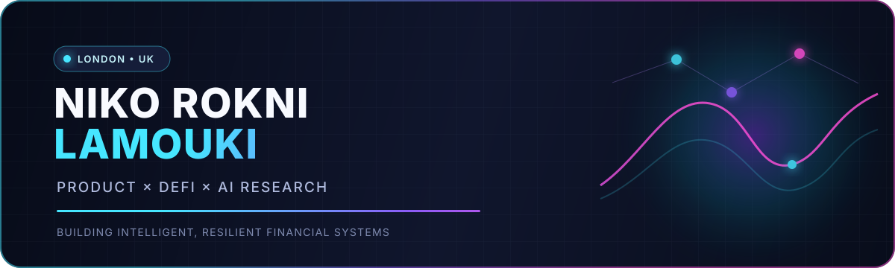
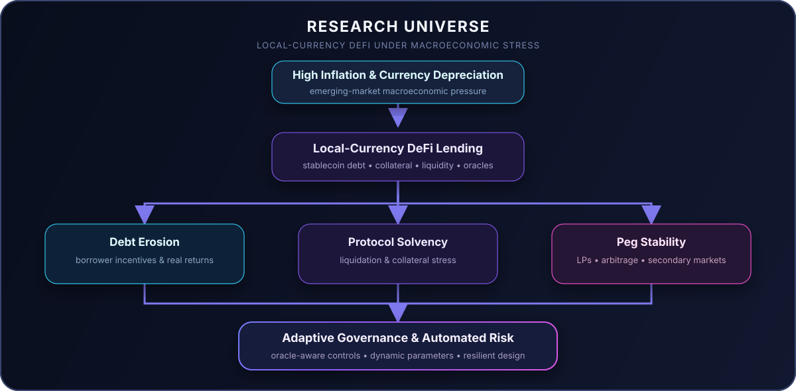

  

  
   
  
  
  

---

## 🧠 About Me

I am a **Product Manager, (HPL)lecturer, and researcher** working where **decentralized finance, artificial intelligence, data, and financial infrastructure** meet. I combine hands-on product leadership with reproducible research to turn difficult financial-system questions into models, experiments, and products that people can actually use.

- 🎓 **MSc Big Data Technologies with Distinction**, University of East London
- 👩‍🏫 **Hourly Paid Lecturer at UEL**, translating technical ideas into practical learning
- 🏦 **4+ years across product, DeFi, fintech, QA, and Agile delivery**
- 🔬 Researching **local-currency stablecoins, DeFi lending, inflation, solvency, peg stability, oracle risk, and adaptive governance**
- ⚙️ Experienced in product strategy, protocol mechanics, risk modelling, data analysis, experimentation, and cross-functional delivery
- 🌍 Based in **London, United Kingdom**
- 🤝 Open to research and PhD collaboration across **DeFi, stablecoins, AI, and financial systems**

> I am especially interested in systems that must remain useful under uncertainty: volatile collateral, fragile pegs, delayed oracles, shifting incentives, and rapidly changing markets.

---

## 🔭 Research Universe

  

---

## 🚀 Featured Research & Projects

<table>
  <tr>
    <td width="50%" valign="top">
      <h3><a href="https://github.com/nikorokni/inflation-driven-debt-erosion-defi">Inflation-Driven Debt Erosion in DeFi</a></h3>
      
A reproducible counterfactual study of whether local-currency DeFi borrowing can create meaningful debt-erosion incentives after borrowing costs, protocol fees, and liquidation risk.

      
<code>Python</code> <code>LaTeX</code> <code>FX Data</code> <code>DeFi</code>

    </td>
    <td width="50%" valign="top">
      <h3><a href="https://github.com/nikorokni/local-currency-defi-solvency-stress-test">DeFi Solvency Stress Test</a></h3>
      
A MakerDAO-calibrated stress-testing framework using ARS/TRY FX data, ETH/BTC market data, and 20,000 joint bootstrap paths to examine collateral and liquidation risk.

      
<code>Stress Testing</code> <code>Bootstrap</code> <code>MakerDAO</code> <code>Risk</code>

    </td>
  </tr>
  <tr>
    <td width="50%" valign="top">
      <h3><a href="https://github.com/nikorokni/local-currency-defi-peg-stability">Local-Currency DeFi Peg Stability</a></h3>
      
Examines liquidity provision, arbitrage bottlenecks, and secondary-market dynamics that determine whether a local-currency stablecoin can defend its peg.

      
<code>Liquidity</code> <code>Arbitrage</code> <code>Stablecoins</code> <code>DEX</code>

    </td>
    <td width="50%" valign="top">
      <h3><a href="https://github.com/nikorokni/local-currency-defi-adaptive-governance">Adaptive Governance & Oracle Risk</a></h3>
      
Designs oracle-aware, automated risk controls for dynamic interest rates, debt ceilings, collateral parameters, and governance under crisis conditions.

      
<code>Governance</code> <code>Oracles</code> <code>Risk Engine</code> <code>Simulation</code>

    </td>
  </tr>
</table>

  
  

---

## 🎓 Education

### MSc Big Data Technologies — Distinction
**University of East London · 2025–2026**

- Dissertation: *Blockchain-Integrated Multi-Agent Reinforcement Learning for Continuous Dynamic Pricing and Occupancy-Aware Demand Response in Urban Microgrids*
- Focus: machine learning, multi-agent reinforcement learning, blockchain settlement, predictive modelling, cloud systems, and data-driven decision-making

### BSc Computer Science
**University of Tehran · 2019–2023**

- Foundations in algorithms, artificial intelligence, data analysis, optimisation, automata, linear programming, calculus, differential equations, and linear algebra
- Teaching Assistant experience across calculus, differential equations, bioinformatics, combinatorics, and scientific writing

---

## 💼 Professional Focus

| Area | What I bring |
|---|---|
| **Product & Strategy** | Product discovery, roadmaps, PRDs, KPI/OKR design, stakeholder alignment, Agile delivery, and go-to-market thinking |
| **DeFi & Stablecoins** | Lending/borrowing mechanics, collateral design, liquidation, oracle architecture, tokenomics, liquidity, governance, and risk frameworks |
| **AI & Data** | Reinforcement learning, predictive modelling, experimentation, reproducible analytics, visualisation, and decision support |
| **Leadership & Teaching** | Cross-functional ownership, Scrum facilitation, technical communication, mentoring, and university-level teaching |

My industry work includes product and delivery roles across **Zarban**, **DeWadi**, and **Bitex**, spanning DeFi lending, stablecoin design, financial-product strategy, QA, and an AI-driven reinforcement-learning trading product.

---

## 🛠️ Tech Stack

### Machine Learning & AI

  

### Blockchain & DeFi

### MLOps & Infrastructure

  

### Databases

  

### Data Visualisation & Research

### Product & Collaboration

---

## 📊 GitHub Analytics

  
  

  

  

### Contribution Activity

  <picture>
    <source media="(prefers-color-scheme: dark)" srcset="https://raw.githubusercontent.com/nikorokni/nikorokni/output/github-contribution-grid-snake-dark.svg" />
    <source media="(prefers-color-scheme: light)" srcset="https://raw.githubusercontent.com/nikorokni/nikorokni/output/github-contribution-grid-snake.svg" />
    
  </picture>

---

## 🤝 Let's Connect

I enjoy conversations about protocol design, stablecoin economics, AI-enabled financial products, risk modelling, and doctoral research collaborations.

  
  

 

  Built around a simple idea: rigorous research should become useful systems.

